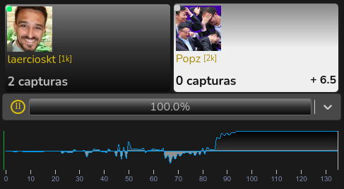

# 3º Torneio do Desassossego - Game 1

This was my first [game](https://online-go.com/game/32115944) of the 3º Torneio do Desassossego against João Ferreira ([Popz](https://www.twitch.tv/gopopz)).

This tournament is happening online during the pandemic, and the _Associação Portuguesa de Go_ ([APGO](http://www.go-portugal.org/)) invite the community to play together.

The game was revised by Helcio Alexandre, a strong Brazilian player who won one of 2 matches in the _Pandanet Go Latin American Team Championship_ final against Argentina in 2020 ([publication](https://pandanet-igs.com/communities/latinamericanleague/488)).

## Review Variations

Review was made at the Discord and there is no comments to show, but you can see the variation below:

 

### B + R

Black wins by White Resignation

